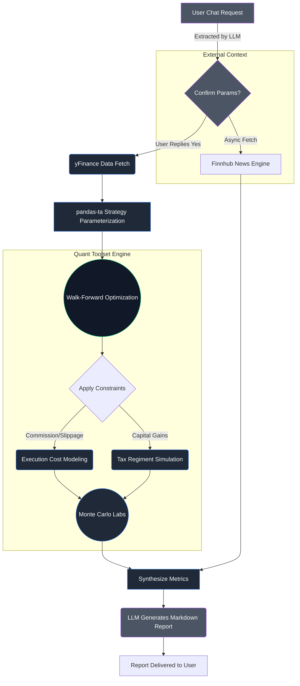

# 🦢 Black Swan Agent
### Adversarial Robustness Testing for Algorithmic Trading Systems

**Black Swan** is a headless, institutional-grade adversarial testing agent for algorithmic trading strategies.

It does not predict markets.  
It **attempts to break your strategy**.

By combining:
- Walk-Forward Optimization (WFO)
- Monte Carlo adversarial simulations
- Strict anti-lookahead backtesting

Black Swan produces **mathematically defensible robustness reports**, not heuristic opinions.

> If your strategy survives Black Swan, it’s worth considering. If it doesn’t, it never was.

---

Black Swan is not a backtesting tool.  
It is a **strategy adversary**.

---

## 🎯 Why Black Swan Exists

Most retail and even semi-professional backtesting systems suffer from:
- **Lookahead bias**
- **Overfitting** via static optimization over the entire dataset
- **Ignoring execution uncertainty** (assuming perfect fills)
- **Misleading single-path equity curves**

Black Swan addresses these by:
- Enforcing strict `t+1` execution semantics
- Using continuous Walk-Forward Optimization instead of global curve-fitting
- Stress-testing strategies across multiple adversarial Monte Carlo regimes
- Evaluating true statistical robustness, not peak performance

---

## 🧠 Design Philosophy

Black Swan follows one rule:

> **"Assume your strategy is wrong. Prove otherwise."**

It does not:
- Predict prices
- Guarantee future returns
- Optimize explicitly for best-case outcomes

It does:
- Stress-test underlying assumptions
- Penalize fragility and drawdowns
- Reward empirical robustness

---

## 👥 Intended Users

- **Quant Developers** validating strategy robustness and out-of-sample stability.
- **Researchers** studying overfitting, parameter sensitivity, and regime transitions.
- **Systems Engineers** building automated trading frameworks requiring high-integrity validation.

*Not designed for: Retail signal generation or manual discretionary trading decisions.*

---

## 🏗 Architecture Overview

```text
User JSON-RPC Request
          ↓
A2A HTTP Server (__main__.py)
          ↓
OpenAI Agent Executor
          ↓
LLM (Intent & Decision Layer)
          ↓
QuantToolset (Deterministic Engine)
          ↓
[WFO + Monte Carlo + Metrics]
          ↓
LLM Summary Formulation -> User
```

---

## 🛤 Implementation Step-by-Step Workflow

Black Swan's execution pipeline is highly deterministic. When a user requests a stress test, the system performs the following sequence of operations:



1. **Intent Extraction (LLM Routing)**
   - The user inputs a strategy query (e.g., *"Run robustness on AAPL SMA for 2 Years"*).
   - The LLM parses the natural language to extract the ticker, strategy type, optimization ranges, execution costs (slippage/fees), and applicable tax regimes.
   - It prompts the user for a final Yes/No confirmation.

2. **Market Data Fetch (`yfinance`)**
   - Upon confirmation, the agent triggers the `QuantToolset`. 
   - Uses the Yahoo Finance API to reliably download raw `Open, High, Low, Close, Volume` (OHLCV) price data for the requested historical window.

3. **Strategy Generation (`pandas-ta`)**
   - The engine validates the strategy string against local indicator mapping.
   - Technical conditions are parameterized dynamically entirely in memory before executing the backtest loop, ensuring clean vector math mappings.

4. **Walk-Forward Optimization (`optuna`)**
   - The timeline is sliced into rolling **Train (6-m)** and **Test (1-m)** windows.
   - Inside each Train block, Optuna runs 150 trials evaluating permutations of the strategy parameters to maximize *Sharpe minus (2 × Max Drawdown)*.
   - The "winning" parameters from the Train block are locked and strictly traded out-of-sample over the consecutive Test block. 
   - This process loops recursively through the dataset to construct the final Out-of-Sample (OOS) equity curve.

5. **Execution Modeling (Slippage, Fees, Taxes)**
   - Trades identified on the OOS curve are subjected to realistic friction.
   - Percentage-based commissions and slippage are deducted mathematically at transaction nodes.
   - A tax-engine traverses all capital gains mapped against standard short-term / long-term capital tax rules relative to local jurisdictions (US, UK, India).

6. **Adversarial Stress Lab (`monte-carlo`)**
   - The net-equity curve is attacked mathematically.
   - Connectivity disruption (force-dropping 20% of trades).
   - Sequence risk via Monte Carlo trade permutation shuffling.
   - 100 iterations of Gaussian Geometric Brownian Motion (GBM) to test strategy breakdown outside historical paths.

7. **Contextual Intelligence (`Finnhub API`)**
   - In parallel with math simulations, Finnhub's `company-news` endpoint fetches verified journalistic headlines for the asset spanning the most recent trailing 14-days.
   - Explicit diagnostics track symbol mapping errors alongside valid headlines to prevent hallucinations.

8. **Risk Report Synthesis**
   - All extracted statistics—WFO OOS returns, VaR/CVaR, fat-tail risk (Kurtosis), Monte Carlo quantiles, and Finnhub headlines—are packed back up the chain.
   - The LLM generates a mathematically grounded, Markdown-formatted diagnostic report cross-referencing systemic strategy risks against recent market headlines.

---

## ⚡ Quick Start

```bash
# 1. Clone the repository
git clone https://github.com/samwasted/nasiko-ai-agent
cd nasiko-ai-agent/a2a-black-swan-agent

# 2. Setup environment
python -m venv venv
source venv/bin/activate

# 3. Install core dependencies
pip install -r requirements.txt

# 4. Set credentials
export OPENAI_API_KEY="your_openai_api_key"
export FINNHUB_API_KEY="your_finnhub_api_key"

# 5. Run the agent
python -m src
```

---

## 🔬 Quantitative Engine

### Walk-Forward Optimization (WFO)
Rather than optimizing parameters over the entire dataset, Black Swan perpetually trains and validates parameters forward through time.

- **Train Window:** 6 months  
- **Test Window:** 1 month (strictly out-of-sample)  
- **Optimizer:** Optuna (150 trials per train window)  
- **Objective Function:** `Sharpe - (2.0 × Max Drawdown)`

### Signal Engine (Dynamic)
Supports dynamic parameterization across standard implementations:
- **Moving Averages:** `sma`, `ema`, `wma`, `hma`, etc.
- **Oscillators:** `rsi`, `cci`, `mfi`, `stoch`
- **MACD Family:** `macd`, `ppo`, `apo`
- **Bands:** `bbands`, `kc`, `dc`

*Note: All signals strictly enforce **t+1 execution lag** to eliminate lookahead bias.*

### Finnhub News Fetch Support
Black Swan supports recent news ingestion through Finnhub and attaches headlines to the report context.

- **Provider:** Finnhub `company-news` endpoint
- **Environment Variable:** `FINNHUB_API_KEY`
- **Default Window:** Recent 14 days
- **Default Limit:** Up to 5 recent headlines

News diagnostics are surfaced in `data_profile` and intended to be printed in the report debug section:

- `recent_news`
- `recent_news_count`
- `news_source`
- `news_status`
- `news_error`
- `news_symbol_used`

Ticker coverage note:

- Finnhub `company-news` is company-equity oriented.
- Symbols like `BTC-USD` may return `unsupported_symbol_for_company_news`.
- When no headlines are available, the agent should treat this as "No verified headlines retrieved" and avoid inferred headline narratives.

---

## 🎲 Adversarial Monte Carlo Lab

Black Swan applies multiple stress regimes to the Out-of-Sample equity curve:

1. **Execution Failure Simulation (Connectivity)**
   - Randomly drops 20% of trades to simulate latency, broker disconnects, or extreme slippage.
2. **Trade Order Randomization**
   - Tests if the strategy's survival was dependent on a specific historical chronological sequence.
3. **Temporal Disorder Simulation**
   - Shuffles market days individually to destroy long-term autocorrelation and trend dependency.
4. **Synthetic Market Generation (GBM)**
   - Generates large-scale Gaussian GBM price paths calibrated to observed volatility.

> **Goal:** Detect fragility, not optimize returns.

---

## ⚡ Performance Characteristics

| Factor | Impact |
|--------|--------|
| **WFO + Optuna** | High CPU thread saturation during Train blocks. |
| **Monte Carlo Labs** | High execution latency (15–30 seconds to return response). |
| **News API (Finnhub)** | Stable JSON endpoint for company news; rate limits depend on plan tier. |

### Modeling Assumptions

To isolate structural robustness, the current engine:
- **Zero Slippage & Fees:** Intentionally ignored to prevent confounding variables during core logic evaluation.
- **Full Capital Allocation:** Assumes unweighted 100% allocations (no position sizing) to expose pure strategy volatility.

*These are deliberate simplifications to isolate the strategy's mathematical integrity before layering in market realism.*

---

## 🚀 Example Usage

Because Black Swan is a headless A2A logic engine, you call it programmatically. Pass dynamic array boundaries directly in the prompt to trigger the optimization engine:

**Request:**
```bash
curl -X POST http://localhost:5000/ \
-H "Content-Type: application/json" \
-d '{
  "jsonrpc": "2.0",
  "id": "1",
  "method": "message/send",
  "params": {
    "message": {
      "messageId": "msg-01",
      "timestamp": "2024-01-01T00:00:00Z",
      "role": "user",
      "parts": [{
        "text": "Run a robustness suite for an SMA strategy on BTC-USD. Use a 3y period. Optimize the fast_period between 5 and 20, and the slow_period between 21 and 100."
      }]
    },
    "metadata": {}
  }
}'
```

### Sample Response Snippet (Data Payload)

```json
{
  "ticker": "BTC-USD",
  "oos_metrics": {
    "cagr": 0.184,
    "max_drawdown": 0.271,
    "sharpe": 1.12
  },
  "monte_carlo": {
    "connectivity_avg": 0.112,
    "worst_case_var95": -0.354,
    "gbm_fail_rate": "12.5%"
  },
  "analytical_narrative": "Strategy displays strong autocorrelation resistance..."
}
```

---

## 🔮 Future Work

- [ ] Real-world slippage and commission cost modeling.
- [ ] Position sizing (Kelly Criterion, ATR-based risk targeting).
- [ ] Multi-asset portfolio simulation and co-integration testing.
- [ ] Market regime detection (bull/bear/sideways segregation).
- [ ] GPU-accelerated Monte Carlo execution paths.
